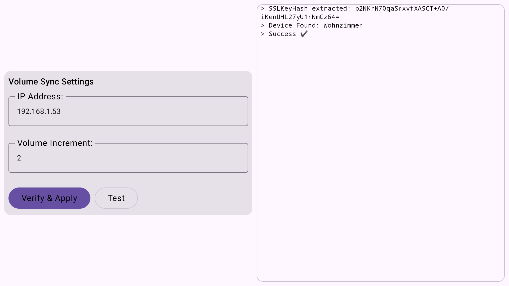
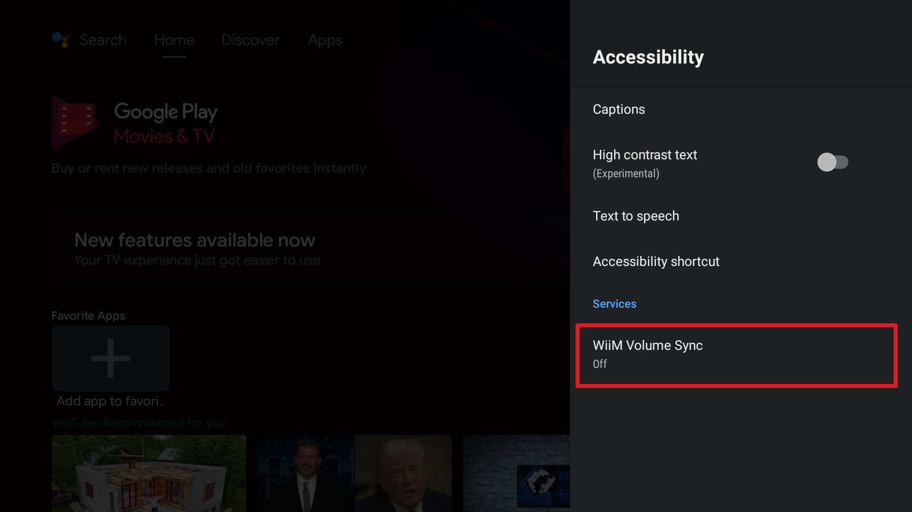

# WiiM Volume Sync

## Introduction

A simple POC app developed for Android TV boxes to sync their system volume with a WiiM Amp.

## Installation

Use ADB do install the app.

1. Enable wireless debugging on the android TV
2. Connect & Install

```shell
adb connect <android-tv-ip>
adb install wiim-volume-sync.apk
```

## Quick start

- Enable WiiM Volume Sync in Accessibility services
- Configure > enter IP Adress of your WiiM device > Apply & Config





## Usage

Use your Android TVs remote to control the Volume on your WiiM Amp.

### Basic operation

The App creates an accessibility service which intercepts Volume +/- commands and transforms them
into a WiiM IP API call.

## Known issues and limitations

The app was mostly hacked together in a day out of necessity. Expect a lot of them.

## Compatibility

Tested on a Nvidia Shield TV.

> Intercepting Keystrokes might not work on newer devices.

## Contributing

Fork/Clone/Copy at your own will.
